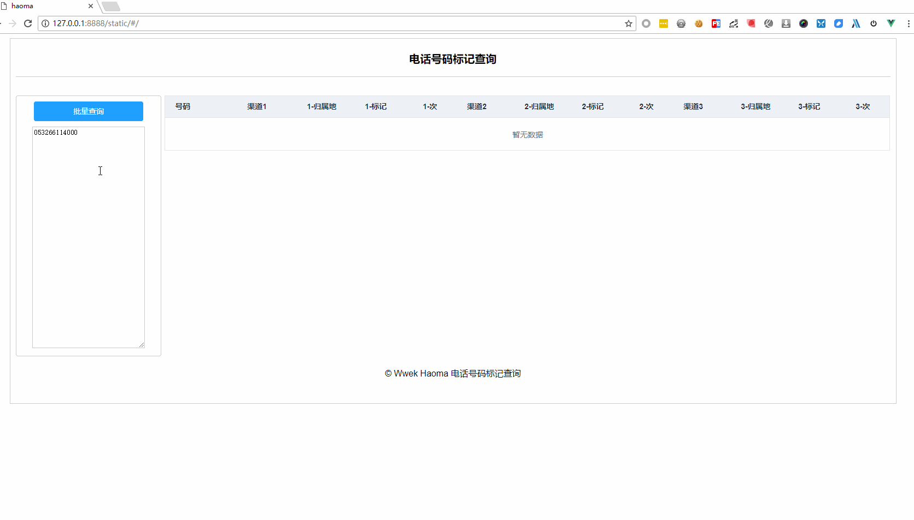

#### Haoma [](https://travis-ci.org/wwek/haoma)

Haoma 是一个电话号码标记批量查询软件,用于批量查询电话号码被标记的信息



#### 快速安装使用
* [Windows系统下载](https://github.com/wwek/haoma/releases/download/v0.2/haoma-v0.2-windows-amd64.tar.gz)
* [Linux系统下载](https://github.com/wwek/haoma/releases/download/v0.2/haoma-v0.2-linux-amd64.tar.gz)
* [OSX苹果系统下载](https://github.com/wwek/haoma/releases/download/v0.2/haoma-v0.2-darwin-amd64.tar.gz)
* 下载后解压后运行软件
* 浏览器打开 http://127.0.0.1:8888 即可使用

#### 从源码安装
假设您本地已经具备nodejs、golang开发环境
```
# 获取源码
git clone https://github.com/wwek/haoma.git
cd haoma
# 编译前端
cd frontend
npm install
npm run build
cd ..
# 编译后端
go build
```
* Windwos系统 运行项目根目录下的 haoma.exe
* 类Unix系统 运行项目根目录下的 ./haoma
* 浏览器打开 http://127.0.0.1:8888 即可使用

#### 技术栈和实现原理
##### 技术栈
* 前端： Vue (axios、element-ui等)
* 后端： Golang（Beego框架）

#### FAQ
* 有建议和疑问?

  提issues。
* 如何保存查询结果?

  您可以保存到excel中,在网页上选取要复制的内容,然后在excel中粘贴即可。


